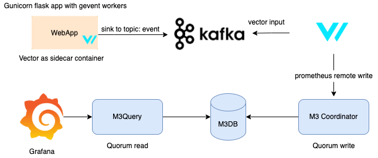

## About

This repository contains all neccessary bits to run the POC with two metrics backend
- Elastic
- M3DB(main focus)

### Prerequisites 

- Docker needs to be installed

- Adjust "Resources" in Docker to have at least 4 GB of memory.

## Stack overview

The stack consists of the latest versions of these components:

- Flask webapp
- [Vector](https://vector.dev/) processor
- [Kafka](https://kafka.apache.org/) Message Queue
- A standalone M3DB node;
- [M3 Coordinator](https://m3db.io/docs/m3coordinator/) and [M3 Query](https://m3db.io/docs/m3query/) instances to interact w/ the [M3DB](https://m3db.io/docs/m3db/) nodes;
- A single [Grafana](https://grafana.com/) instance;

Note: We can substitute M3 and Grafana with Elastic and Kibana in a seperate docker-compose file

The M3 Coordinator instance takes all read and write requests, and then distributes them to the cluster of M3DB nodes.

The M3 Query instance is used to query all data from the M3DB node(s) via Grafana.

At the start, Grafana will be configured with M3Query: 

- [M3 Query endpoint](http://localhost:7221)



**List of container instances**

| Container   | Endpoints 	| Notes		|
| ----------- | ----------- |-----------|
| webapp| [http://localhost:5000](http://localhost:9090)|Gunicorn Flask webapp|
| vector_sidecar| [localhost:8889](http://localhost:9090)|Gunicorn Flask webapp|
| kafka| [localhost:8889](http://localhost:9090)|Gunicorn Flask webapp|
| zookeeper| [localhost:8889](http://localhost:9090)|Gunicorn Flask webapp|
| kafka_topics_ui| [localhost:8889](http://localhost:9090)|Gunicorn Flask webapp|
| kafka_ui| [localhost:8080](http://localhost:9090)|Gunicorn Flask webapp|
| vector| [localhost:8888](http://localhost:9090)|Gunicorn Flask webapp|
| grafana| [http://localhost:3000](http://localhost:3000)|Grafana instance w/ multiple datasources configured|
| m3db_seed	  | localhost:2379; localhost:909[0-2]| M3DB instance, running built-in etcd service (2379 TCP port). |
| m3coordinator| 0.0.0.0:7201 | Exposes Prometheus Remote Read and Write API on TCP 7201 port |
| m3query | 0.0.0.0:7221  | Exposes Prometheus Remote Read API on TCP 7221 port, used as a Grafana data source to query data in the M3DB cluster|
| fluentbit | 0.0.0.0:2021  | FluentBit agent w/ both Prometheus exporter and Prometheus remote write outputs enabled|
| provisioner | N/A | Prepares M3DB node on startup (creates M3DB namespace and initialises placement) |

## Instructions for the workshop

### Step 1: Go to the M3 Workshop Fluentcon repo and clone the repo onto your local machine: 

Link to repo: https://github.com/fluent/m3-workshop-fluentcon

### Step 2: Start up the stack via Docker-Compose

Run the following command:

```$:~ docker-compose up```

Once you see the following output (with code 0 at the end), the stack is configured and ready to be used: 

```
provisioner_1      | Waiting until shards are marked as available
provisioner_1      | Provisioning is done.
provisioner_1      | Prometheus available at http://localhost:9090
provisioner_1      | Prometheus replica is available at http://localhost:9091
provisioner_1      | Grafana available at http://localhost:3000
m3-workshop_provisioner_1 exited with code 0
```

Logs of the `provisioner` process can be seen either by following the output of the `docker-compose up` or by running the following command: ```docker-compose logs provisioner```

### Step 3: Open up Grafana 

Once the stack is up and running, login into the [Grafana](http://localhost:3000) using `admin:admin` credentials and then head to the [Explore](http://localhost:3000/explore) tab.

Grafana: http://localhost:3000

**Note:** Press "skip screen" in Grafana when prompting you to set a password. 

### Step 4: Explore the Prometheus data sources in Grafana

In the [Explore](http://localhost:3000/explore) tab of Grafana, you will see three datasources - default, Prometheus, and M3Query. 
Prometheus instance is scraping itself and the `node_exporter` metrics of `fluentbit` container being exported via one of the FluentBit outputs. FluentBit `node_exporter` metrics also end up 
in the M3DB node via Prometheus remote write API. You can use `up{}` PromQL query in the Grafana to inspect which datasources return the results.

### Step 5 - Spinning down the stack

Press `Ctrl+C` to interrupt the already running `docker-compose up` process, or run the following command:

```$:~ docker-compose down```

**Recommended step:** it leaves container disks intact. If you want to get rid of the data as well, run the following command:

```$:~ docker-compose down -v``